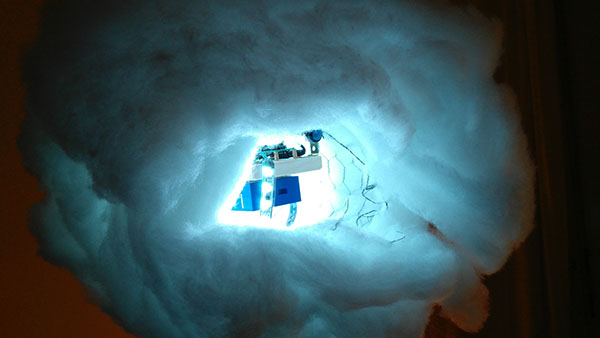

## [:cloud: Thundercloud :cloud:](https://gnihi.github.io/thundercloud/)

This is a guide to create a beautiful arduino based thundercloud with an external sound source to trigger lightning.

---

## Breadboard and schematic

---

## BOM - Bill of material

	This setup uses a 12v power supply to power a 12v led stipe!
	If you want to use a 5v neopixel you can remove the step up converter of the shopping list. 

- 1x micro controller 5v-12v
	- [Arduino Nano](https://store.arduino.cc/arduino-nano) or something similar like the [Kuman Mini Nano](http://www.kumantech.com/kuman-mini-nano-v30-atmega328p-5v-16m-micro-controller-board-module-for-arduino-ky64_p0256.html)
- 1x led stripe (ca. 75 led pixels)
	- [Adafruit NeoPixel 60/m](https://www.adafruit.com/product/1138) **(5V!)** or a cheaper alternative like the [BTF-LIGHTING WS2811](http://www.btf-lighting.com/productshow.asp?ArticleID=0&id=172&cid=001) **(12V!)**
- 1x microphone module
	- [Electret Microphone Amplifier](https://www.adafruit.com/product/1063) 
- 1x bluetooth speaker
	- [JBL GO](https://www.jbl.com/bluetooth-speakers/JBL+GO.html)
- 1x usb power supply
	- With two usb slots
- 1x extension cable
- 1x usb 5v to 12 v step up converter
- 1x dc adapter
- 1x 1000uf  capacitor
- 1x 1000 ohms resistor
- 1x 470 ohms resistor
- breadboard
- solder board
- enough jumper and cables
- soldering equipment

**building materials**

- wood
- chicken wire
- polyester batting
- fiberfill
- needle and thread

---

## Assembly

1. Gather all materials and parts.

2. Create the circuit on a breadboard. 

	It's the best way to figure out circuit problems and sort out broken parts.
	Trust me you don't want to fix these problems when everything is assembled...
	
	Here is a sample breadboard (without the cloud mode switch)
	

3. Solder everything on a solder board

4. Build a robust structure on a solid base

	

5. Build a mounting and wrap the chicken wire around the structure

	It's important to think about a maintenance opening to turn on the speaker and fiddle around inside.
	Don't get too much into detail, the structure of the chicken wire only defines the finished cloud a little bit.
	
	
	
6. Sew the polyester batting around the cage and mount the wool

7. Bring the wool into shape

	

8. Enjoy :)

	
	

---

### Helpful links

- [Arduino Nano Pinout](http://www.pighixxx.com/test/pinouts/boards/nano.pdf)
- [Adafruit NeoPixel uberguide](https://learn.adafruit.com/adafruit-neopixel-uberguide/basic-connections)
- [Measuring sould levels](https://learn.adafruit.com/adafruit-microphone-amplifier-breakout/measuring-sound-levels)

---

A big shout out to Richard Clarkson for his inspiring work!

